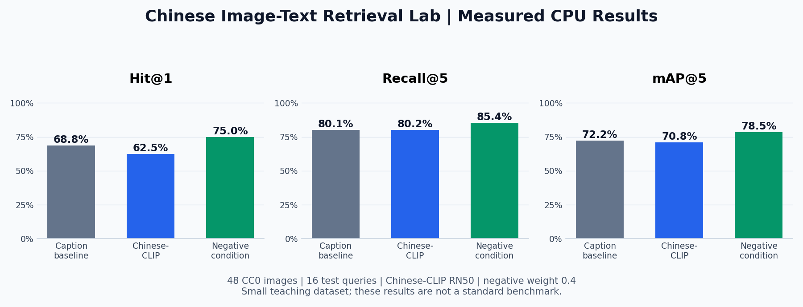

# 中文图文检索学习实验室

在本地 CPU 上探索中文图文检索的学习工具。

**用真实图片比较人工描述匹配、预训练图文相似度和简单排除条件实验，检查排序、导出评估报告，并记录自己的观察。无需 GPU、付费 API 或模型训练。**

[English](README.md) | 中文

[快速启动](#快速启动) · [检索方法](#检索方法) · [实际实验结果](#实际实验结果) · [文档](#文档)



*来自已记录 CPU 实验的指标图：48 张图片、16 条测试查询、排除权重 0.4。这是实验结果图，不是网页界面截图。*

## 可以做什么

- 使用预训练 Chinese-CLIP RN50，在 CPU 上用中文描述检索图片。
- 比较三种检索方法，查看实际解析出的正向与排除条件。
- 按查询划分和类别评估，导出真实 JSON 与 Markdown 报告。
- 在本地保存关于假设、观察、失败与下一步实验的学习笔记。

随项目提供的教学集包含 **48 张真实 Met 开放藏品图像与 32 条中文查询**。每张图像保留官方来源记录和 CC0 证据。网页使用中文界面与本地资源，无需 CDN。

## 快速启动

项目提供的启动器与准备脚本面向 **Windows**；已记录的运行环境使用 **Python 3.9.25**。安装 Python 后，在项目目录运行以下命令。

### 首次准备

```powershell
powershell -ExecutionPolicy Bypass -File scripts/setup.ps1
```

脚本会创建 `.venv`、安装固定版本依赖与 CPU PyTorch、下载约 308 MB 的官方模型权重，并检查或下载图库图片。首次准备需要网络；依赖、权重与图片齐备后，检索和实验可以在本机离线运行。

模型文件、缓存和个人笔记已由 `.gitignore` 排除。

### 启动网页

双击 **`start.cmd`**，或运行：

```powershell
.\.venv\Scripts\python.exe app.py --open
```

浏览器打开 `http://127.0.0.1:8765`。保留启动窗口，按 Ctrl+C 或关闭窗口停止服务。

在网页点击 **“构建图片向量”**。首次会逐张编码图库，后续复用经过图片内容指纹核验的索引。模型加载与首次建库会使用 CPU 和内存，可能需要几分钟。准备前可以使用人工描述基线；模型方法需要真实索引就绪。

## 检索方法

| 方法 | 输入 | 学习目的 |
| --- | --- | --- |
| 人工描述基线 | 人工中文标题、描述与标签；TF-IDF 词项匹配 | 不使用图像编码器，观察词汇重合与描述覆盖率。 |
| 原始 Chinese-CLIP | 图片向量与完整中文查询向量 | 检查预训练跨模态余弦相似度。 |
| 排除条件实验 | 正向描述与排除描述分别编码 | 检验无需训练的惩罚方法，同时观察失败。 |

向量经过 L2 归一化，计算方式为：

```text
原始方法：score = cosine(image, query)
排除实验：score = cosine(image, positive) − weight × cosine(image, negative)
```

支持 **“杯子，不要红色”**、**“鸟，但不含蓝色”** 等格式；网页会显示实际解析的条件。这是已有思路的教学实现，不是原创算法，也不保证理解任意否定句。没有排除条件时，排除方法只使用正向查询。

模型沿用官方 52 个 token 的上下文，其中包含两个特殊 token。超过 50 个内容 token 会明确报错，不会静默截断。人工描述基线接受最多 300 字符。**相似度分数不是置信概率。**

## 实际实验结果

[完整报告快照](docs/results/cpu-test-report.json) 记录了 **2026 年 9 月 29 日**的 CPU 实验：完整图库 48 张，**test 查询 16 条**，其中物体 4 条、属性 6 条、排除条件 6 条。排除权重预设为 **0.4**，没有训练，也没有在验证集或测试集搜索参数。

| 方法 | Hit@1 | Hit@5 | Recall@5 | mAP@5 |
| --- | ---: | ---: | ---: | ---: |
| 人工描述基线 | 68.75% | 93.75% | 80.06% | 0.7220 |
| 原始 Chinese-CLIP | 62.50% | 100.00% | 80.21% | 0.7079 |
| 排除条件实验，权重 0.4 | 75.00% | 100.00% | 85.42% | 0.7852 |

排除条件方法使两条测试查询的 Top-1 从错误变为正确。在六条排除查询中，其 Hit@1 为 **33.33%**，原始 Chinese-CLIP 为 **0.00%**；**仍有四条排除查询的 Top-1 失败**。

“椅子，不要坐垫”使无坐垫椅子升至第一；“杯子，不要碟子”仍将带碟子的杯子排在第一，而且 Recall@5 下降。成功与退步案例详见 [实验分析](docs/EXPERIMENT_RESULTS.md)。

这些是小规模人工标注教学集上的描述性结果，图片以博物馆藏品和艺术作品为主，不是标准基准，也不能证明通用检索能力提升。人工描述基线获得人工文本，CLIP 获得图片，两者信息不同。报告中的计时复用缓存，不包含首次模型加载与建库，不是独立冷启动测量。

### 重跑实验

完成准备后运行：

```powershell
.\.venv\Scripts\python.exe scripts/prepare_gallery.py --check
.\.venv\Scripts\python.exe scripts/run_experiment.py --split test --negative-weight 0.4
```

报告写入 `cache/report.json`，包括配置、汇总与分类指标、相关图片 ID 和逐查询排序。网页也可以运行并导出实验。模型结果来自实际编码器；缺少模型组件时会报错，不会产生模拟的 CLIP 结果。

- **Hit@K：**前 K 项是否至少包含一张标注正例，再对查询求平均。
- **Recall@K：**前 K 项找回的正例数，除以该查询全部标注正例数。
- **AP@K：**在前 K 项的相关位置累计 precision，再除以 `min(K, 正例数)`；mAP@K 是查询的 AP 平均值。

完整 32 条查询划分为 16 条 validation 与 16 条 test，两组检索同一图库。探索参数时应先在 validation 定义选择规则，固定后再评估 test。学习笔记模板需要根据自己的运行填写，不代表已经完成的个人经历。

## 验证

```powershell
.\.venv\Scripts\python.exe -m unittest discover -s tests -v
node --check web/app.js
```

本地服务运行时，可检查检索、报告导出和笔记接口：

```powershell
.\.venv\Scripts\python.exe scripts/smoke_test.py
```

冒烟测试结束后会恢复原有笔记。自动检查覆盖后端行为；**当前没有网页界面的视觉验收证据**。

## 文档

| 文档 | 内容 |
| --- | --- |
| [数据来源](docs/DATA_SOURCES.md) | 官方图片来源、CC0 证据、标注与查询划分边界。 |
| [实验结果](docs/EXPERIMENT_RESULTS.md) | 真实指标、成功与失败查询，以及解释局限。 |
| [完整报告](docs/results/cpu-test-report.json) | 已记录的完整配置与逐查询结果。 |
| [学习路线](docs/LEARNING_GUIDE.md) | 将自己的运行整理为假设、证据与学习笔记。 |
| [调研背景](docs/RESEARCH.md) | 模型选择与相关研究。 |

`lab/` 为主要实现，`web/` 为中文网页，`data/` 为教学图库与查询，`scripts/` 为准备和实验命令。HTTP 服务只监听 `127.0.0.1`，查询和笔记保存在本地服务中。

## 来源与署名边界

- **模型：**[Chinese-CLIP 官方实现](https://github.com/OFA-Sys/Chinese-CLIP)、[技术报告](https://arxiv.org/abs/2211.01335) 和 [官方 RN50 权重](https://huggingface.co/OFA-Sys/chinese-clip-rn50)。下载器固定 revision `717ba215769231e53b9b7c6b9d329b9cc5944418`，接收文件前核验官方 LFS SHA-256。项目使用预训练模型进行 CPU 推理，没有训练 CLIP。
- **图片：**[Met Open Access](https://www.metmuseum.org/hubs/open-access)、[官方 API](https://metmuseum.github.io/) 与 [CC0 1.0](https://creativecommons.org/publicdomain/zero/1.0/)。只收录明确标记为公有领域且提供官方开放图片地址的记录。中文标题与描述用于教学，不是博物馆官方译名。
- **项目范围：**提供本地应用、评估工具和教学数据，不宣称原创检索方法，也不复现相关论文的完整实验。

模型权重不随仓库分发。模型与图像遵循各自来源的许可。
